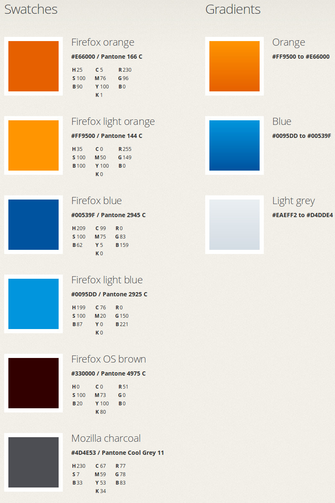
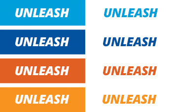
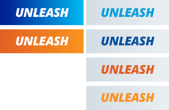

# Firefox OS color #

Use these colors to guide your designs and layouts, both online and off, to ensure you’re staying consistent with the Firefox OS brand.

## Type and color combinations

Never use more than two colors between type and the background. Limit one gradient per composition, whether applied to the type or the background. For maximum contrast, use white type on a color or gradient background.

### Color background or type

### Gradient backgrounds

### Vertical gradient type

